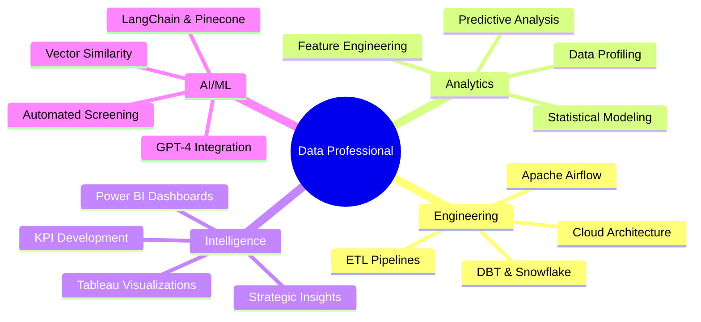

# Hi there! 👋 I'm **Mansi Thorat**

<div align="center">
  
[](https://git.io/typing-svg)

</div>

<div align="center">
  

[](https://linkedin.com/in/mansithorat)
[](mailto:your.email@example.com)
[](https://your-portfolio-link.com)

</div>

---

## 🚀 **About Me**

> *Passionate about transforming raw data into meaningful insights that drive strategic decision-making*

I am a **data-driven professional** with expertise in **data engineering, analytics, and business intelligence**. With a strong foundation in **Python, SQL, Power BI, Airflow, DBT, and cloud technologies**, I specialize in designing scalable **ETL pipelines, optimizing data workflows, and building interactive dashboards** for strategic decision-making. 

My diverse experience spans **AI-driven solutions, real-time analytics, and data visualization**, making me a versatile asset in the evolving tech landscape.

<div align="center">



</div>

---

## 🎓 **Education**

<table align="center">
<tr>
<td align="center">

<br><b>Northeastern University, Boston</b>
</td>
<td align="center">

<br><b>Savitribai Phule Pune University, India</b>
</td>
</tr>
</table>

---

## 💻 **Technical Arsenal**

<div align="center">

### **Languages & Frameworks**


### **Data Engineering & ETL**


### **Analytics & Visualization**


### **AI & Machine Learning**


### **Cloud & Big Data**


</div>

---

## 📊 **Key Metrics & Impact**

<div align="center">
  
<table>
<tr>
<td align="center"><b>🎯 Projects Completed</b><br/><font size="6"><b>10+</b></font></td>
<td align="center"><b>📈 Records Analyzed</b><br/><font size="6"><b>3.2M+</b></font></td>
<td align="center"><b>🔒 Data Protection</b><br/><font size="6"><b>+25%</b></font></td>
<td align="center"><b>⚡ Efficiency Boost</b><br/><font size="6"><b>+30%</b></font></td>
</tr>
<tr>
<td align="center"><b>🐛 Issues Identified</b><br/><font size="6"><b>200+</b></font></td>
<td align="center"><b>📉 Redundancy Reduced</b><br/><font size="6"><b>-20%</b></font></td>
<td align="center"><b>🚀 Response Time</b><br/><font size="6"><b>+15%</b></font></td>
<td align="center"><b>📦 Distribution Efficiency</b><br/><font size="6"><b>+20%</b></font></td>
</tr>
</table>

</div>

---

## 🏆 **Featured Projects & Achievements**

### 🚀 **Data Engineering & Automation**

<details>
<summary><b>🌤️ Automated Weather Data ETL Pipeline</b></summary>
<br>

- **Tech Stack**: `Apache Airflow` • `PostgreSQL` • `Python` • `APIs`
- **Achievement**: Developed an **Apache Airflow**-powered ETL pipeline to fetch real-time weather data via API, transform it, and store it in **PostgreSQL**
- **Impact**: Automated scheduling ensured seamless data updates for downstream analytics
- **Key Features**:
  - ✅ Real-time data ingestion
  - ✅ Automated data transformation
  - ✅ Scheduled pipeline execution
  - ✅ Error handling & monitoring

</details>

<details>
<summary><b>🤖 Intelligent Resume Screening with LLM & LangChain</b></summary>
<br>

- **Tech Stack**: `GPT-4` • `LangChain` • `Pinecone` • `Streamlit` • `Vector Search`
- **Achievement**: Engineered an **AI-driven resume screening tool** using **GPT-4 & Pinecone**, streamlining candidate selection
- **Impact**: Enhanced recruiter efficiency through vector similarity search
- **Key Features**:
  - ✅ AI-powered candidate matching
  - ✅ Vector similarity search
  - ✅ Interactive Streamlit UI
  - ✅ Automated screening workflow

</details>

### 📊 **Data Analysis & Business Intelligence**

<details>
<summary><b>💰 Salary Prediction Feature Analysis</b></summary>
<br>

- **Tech Stack**: `Python` • `Scikit-Learn` • `Statistical Analysis` • `Feature Engineering`
- **Achievement**: Conducted **data profiling, feature engineering, and statistical analysis** on 10,000+ records
- **Impact**: Identified key salary predictors using multiple ML techniques
- **Key Insights**:
  - 📈 Top salary influencing factors identified
  - 🎯 ML model accuracy optimization
  - 📊 Statistical significance validation

</details>

<details>
<summary><b>🚗 Urban Traffic Crash Data Profiling</b></summary>
<br>

- **Tech Stack**: `Python` • `Talend` • `Statistical Analysis` • `Data Transformation`
- **Dataset**: **3.2M+ accident records** from major US cities
- **Achievement**: Identified key risk factors and proposed data transformation strategies
- **Impact**: 
  - 🔍 Risk pattern identification
  - 📋 Data quality improvement recommendations
  - 🛠️ ETL process optimization

</details>

<details>
<summary><b>🍽️ Integrated Food Safety Analytics</b></summary>
<br>

- **Tech Stack**: `Navicat` • `Alteryx` • `Python` • `SQL Server` • `Power BI` • `Tableau`
- **Achievement**: Designed a comprehensive **BI solution** for food safety management
- **Impact**: 
  - 📉 Data redundancy reduced by **20%**
  - 🔒 Data protection improved by **25%**
  - 📊 Real-time monitoring dashboards

</details>

<details>
<summary><b>🎫 Service Request Analytics</b></summary>
<br>

- **Tech Stack**: `Power BI` • `Tableau` • `SQL` • `Cross-functional Collaboration`
- **Achievement**: Led a **cross-functional data initiative** analyzing service operations
- **Impact**: 
  - 🐛 Uncovered **200+ data inconsistencies**
  - ⚡ **15% improvement** in service response times
  - 📊 Interactive dashboard deployment

</details>

### 💡 **Strategic Data Solutions & AI-driven Insights**

<details>
<summary><b>💳 Personal Finance Management System</b></summary>
<br>

- **Tech Stack**: `Database Design` • `SQL` • `Stored Procedures` • `Triggers`
- **Achievement**: Built a **scalable data model** with optimized storage architecture
- **Impact**:
  - 📉 Storage redundancy reduced by **20%**
  - ⚡ Data loading efficiency increased by **30%**
  - 🔄 Automated data processing workflows

</details>

<details>
<summary><b>📉 Recession Analysis</b></summary>
<br>

- **Tech Stack**: `Python` • `Statistical Modeling` • `Time Series Analysis`
- **Achievement**: Applied **Python-based statistical modeling** to detect recession trends
- **Impact**: Generated actionable insights for economic forecasting
- **Key Deliverables**:
  - 📊 Trend analysis reports
  - 🔮 Predictive modeling results
  - 📈 Economic indicator correlations

</details>

<details>
<summary><b>💉 Smart COVAX Distribution System</b></summary>
<br>

- **Tech Stack**: `AI/ML` • `Supply Chain Optimization` • `Logistics Analytics`
- **Achievement**: Designed an **AI-driven vaccine distribution platform**
- **Impact**: 
  - 🚀 Distribution efficiency increased by **20%**
  - 📦 Supply chain logistics optimization
  - 🎯 Resource allocation improvement

</details>

---

## 🌟 **What Makes Me Different?**

<div align="center">

| 💡 **AI-Driven Mindset** | 🚀 **Full-Stack Data Expertise** |
|:---:|:---:|
| I blend **AI, automation, and data engineering** to create intelligent, scalable solutions | From **ETL pipelines** to **BI dashboards**, I handle **end-to-end data workflows** |

| 📈 **Business-Centric Approach** | 🎯 **Impact-First Thinking** |
|:---:|:---:|
| I don't just process data—I **translate it into strategic insights** for decision-makers | Every data solution I build **drives efficiency, automation, and ROI** for organizations |

</div>

---

## 📈 **GitHub Analytics**

<div align="center">
  


</div>

---

## 🎯 **Current Focus Areas**

```python
current_learning = {
    "Advanced AI/ML": ["Large Language Models", "Vector Databases", "RAG Systems"],
    "Cloud Architecture": ["AWS Data Services", "Serverless Analytics", "Real-time Processing"],
    "Data Engineering": ["Event-driven Architectures", "Stream Processing", "DataOps"],
    "Business Intelligence": ["Advanced Analytics", "Predictive Modeling", "Self-service BI"]
}

goals_2025 = [
    "🎯 Implement MLOps best practices",
    "🚀 Build scalable real-time analytics platforms", 
    "💡 Develop AI-powered business intelligence solutions",
    "📊 Master advanced cloud data architectures"
]
```

---

## 🤝 **Let's Connect & Collaborate!**

<div align="center">

**I'm always excited to discuss data projects, share insights, and explore collaboration opportunities!**

[](https://linkedin.com/in/mansithorat)
[](mailto:your.email@example.com)
[](https://your-portfolio-link.com)

</div>

---

<div align="center">

### 🚀 **"Transforming Data into Strategic Advantages"** 🚀


</div>
